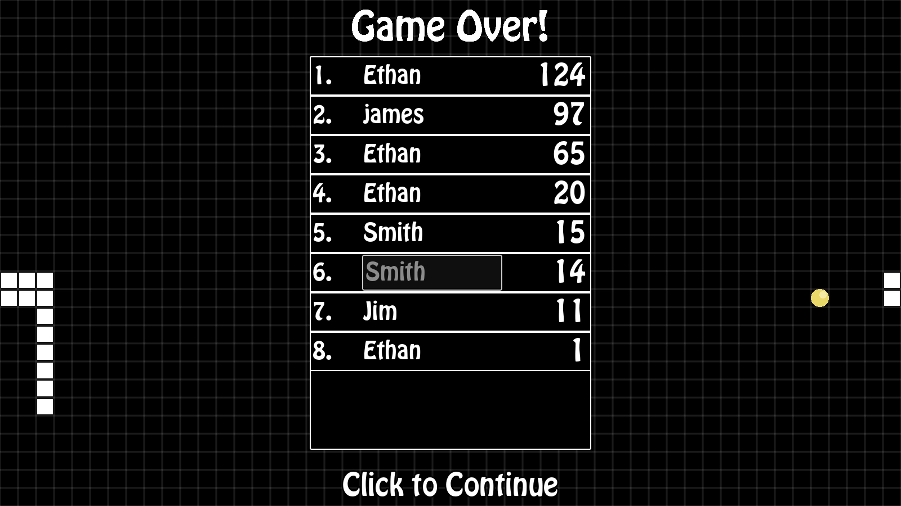
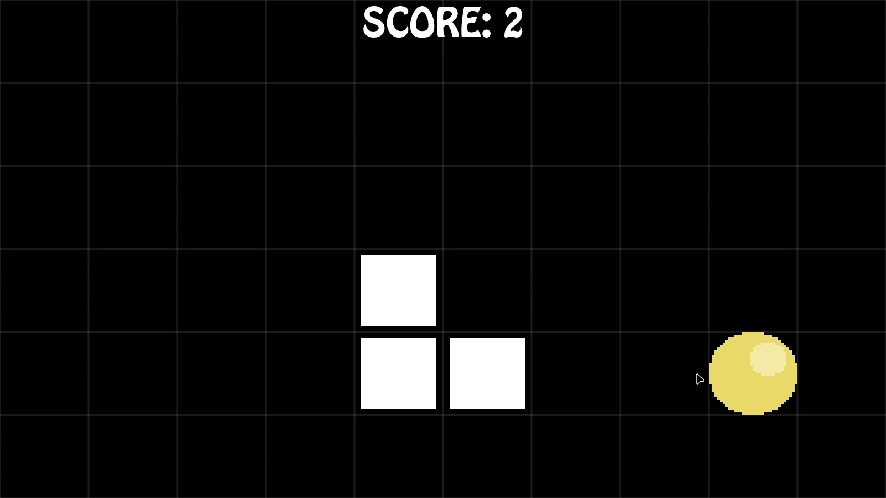
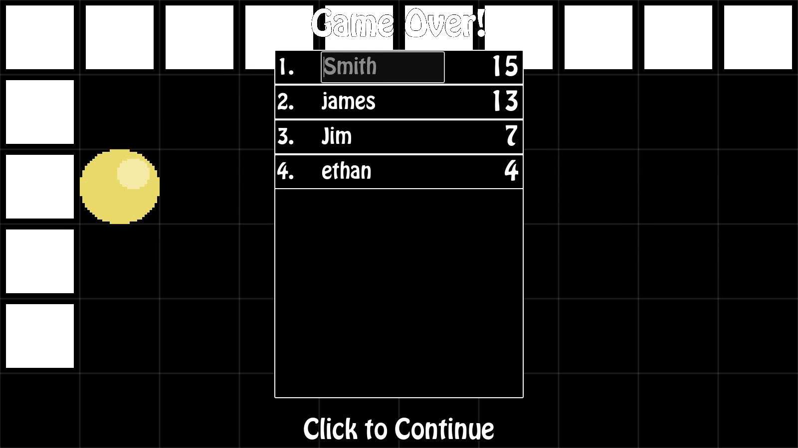
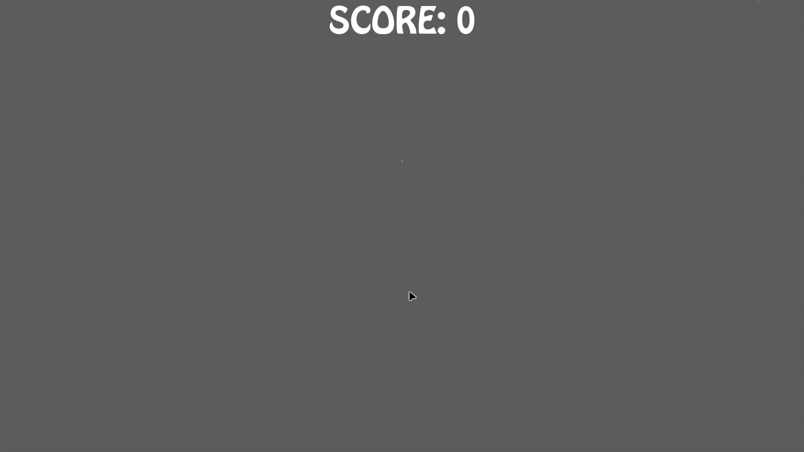
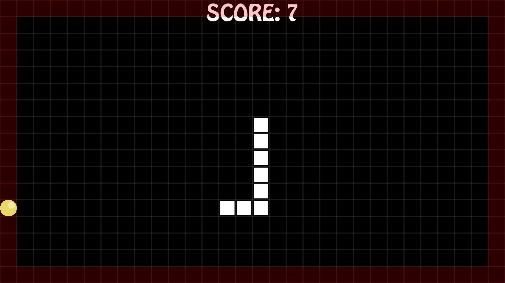

# Snake-Game
A snake game created in Godot
This project was started for the Boot.Dev personal project module. This is my first project using the game engine Godot.

## Game Features
- Basic snake gameplay. You start as a dot and grow as you collect the targets. If you collide with your tail its game over.
- Grid, speed and edge wrapping are configurable with multiple options. Each set of options tracks scores indepentally.
- Sound effects
- Music
  - Music becomes more intense the closer the player is to the target
  - Can be disabled
- Save System
  - Saves the last ruleset used.
  - Saves the music enabled setting

## Download
I've exported the game for Windows and Linux because I can test these platforms.
Check the Releases page for downloads.

## Packages Used
[Using UI themes by Azagaya](https://azagaya.itch.io/kenneys-ui-theme)

[Using SFX by Cyrex Studios](https://cyrex-studios.itch.io/universal-ui-soundpack) ([Nathan Gibson](https://nathangibson.myportfolio.com ))

[Using music by Leohpaz and Krishna Palacio](https://leohpaz.itch.io/minifantasy-dungeon-sfx-pack)

[Using SFX by Dagurasusk](https://dagurasusk.itch.io/retrosounds)

[Using SFX by Masked Sound](https://maskedsound.itch.io/8-bit-sfx-pack)

## Screenshots

